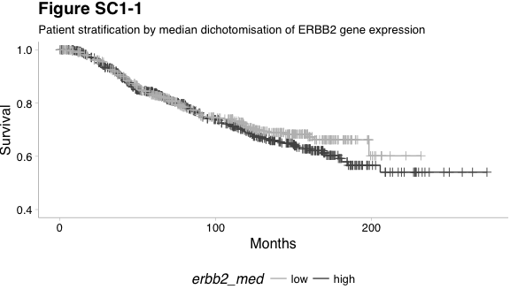
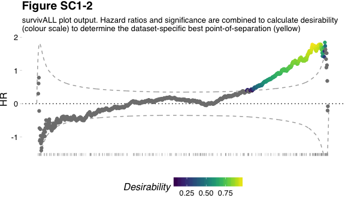

Continuous Biomarker Assessment by Exhaustive Survival Analysis - Supplementary 1
=================================================================================

#### 2018-02-15

Dominic A. Pearce<sup>1</sup>, Ajit J. Nirmal<sup>2</sup>, Tom Freeman<sup>2</sup>, Andrew H. Sims<sup>1</sup>

<sup>1</sup>Applied Bioinformatics of Cancer, University of Edinburgh Cancer Research Centre, Institute of Genetics and Molecular Medicine, Edinburgh, UK <sup>2</sup>Systems Immunology Group, Division of Genetics and Genomics, The Roslin Institute and Royal (Dick) School of Veterinary Studies, University of Edinburgh, Easter Bush, Midlothian, EH25 9RG
\*<andrew.sims@ed.ac.uk>

 

Rationale
---------

 

### Libraries

``` r
library(survivALL)
library(survival)
library(survcomp)
library(Biobase)
library(magrittr)
library(ggplot2)
library(GGally)
library(ggthemes)
library(cowplot); theme_set(theme_grey())
```

 

Rationale
=========

Survival analysis typically stratifies a patient cohort by some measure and compares the relative survival between groups. In practice, for a continuous measure, the decision of *where* to draw this division relies on previous knowledge or, more problematically, it may simply be a researchers best guess - for example separating around the median.

To investigate these considerations, we utilised the previously published METABRIC dataset. As part of the original IntClust10 subtyping scheme publication, the METABRIC data was divided into compositionally matched *discovery* and *validation* subsets. METABRIC gene expression data used for this analysis was downloaded, upon request, from [https://www.synapse.org/](https://www.synapse.org/#!Synapse:syn1688369/wiki/27311)

Below are outlined 2 alternative survival analysis approaches --- a **median** approach as well as our own **data-driven** approach, as part of the `survivALL` package.

 

Association of a continuous marker with survival
------------------------------------------------

We begin with an expressionSet `disc`, the discovery cohort of the METABRIC dataset. `disc` details both gene expression as well as survival information (i.e. event and time-to-event data) for 981 invasive breast cancer patients of no specific subtype and with complete survival information. Here the event we will be measuring is disease-specific survival or *dss*.

 

``` r
disc <- readRDS("discovery-eset.Rds")
disc_bootstrap <- read.delim("disc-bs.txt") #for more information regarding 
                                            #bootstrapping see Supplementary 4
```

``` r
pData(disc)[1:3, ]
```

<table style="width:78%;">
<caption>Survival Information (continued below)</caption>
<colgroup>
<col width="19%" />
<col width="26%" />
<col width="31%" />
</colgroup>
<thead>
<tr class="header">
<th align="center"> </th>
<th align="center">age_at_diagnosis</th>
<th align="center">last_follow_up_status</th>
</tr>
</thead>
<tbody>
<tr class="odd">
<td align="center"><strong>MB-0362</strong></td>
<td align="center">52.79</td>
<td align="center">d</td>
</tr>
<tr class="even">
<td align="center"><strong>MB-0346</strong></td>
<td align="center">32.61</td>
<td align="center">d</td>
</tr>
<tr class="odd">
<td align="center"><strong>MB-0386</strong></td>
<td align="center">66.83</td>
<td align="center">a</td>
</tr>
</tbody>
</table>

<table style="width:100%;">
<caption>Table continues below</caption>
<colgroup>
<col width="19%" />
<col width="39%" />
<col width="10%" />
<col width="10%" />
<col width="9%" />
<col width="9%" />
</colgroup>
<thead>
<tr class="header">
<th align="center"> </th>
<th align="center">menopausal_status_inferred</th>
<th align="center">group</th>
<th align="center">grade</th>
<th align="center">size</th>
<th align="center">stage</th>
</tr>
</thead>
<tbody>
<tr class="odd">
<td align="center"><strong>MB-0362</strong></td>
<td align="center">post</td>
<td align="center">4</td>
<td align="center">2</td>
<td align="center">18</td>
<td align="center">2</td>
</tr>
<tr class="even">
<td align="center"><strong>MB-0346</strong></td>
<td align="center">pre</td>
<td align="center">3</td>
<td align="center">3</td>
<td align="center">16</td>
<td align="center">2</td>
</tr>
<tr class="odd">
<td align="center"><strong>MB-0386</strong></td>
<td align="center">post</td>
<td align="center">4</td>
<td align="center">3</td>
<td align="center">15</td>
<td align="center">3</td>
</tr>
</tbody>
</table>

<table style="width:90%;">
<caption>Table continues below</caption>
<colgroup>
<col width="19%" />
<col width="31%" />
<col width="30%" />
<col width="8%" />
</colgroup>
<thead>
<tr class="header">
<th align="center"> </th>
<th align="center">lymph_nodes_positive</th>
<th align="center">lymph_nodes_removed</th>
<th align="center">NPI</th>
</tr>
</thead>
<tbody>
<tr class="odd">
<td align="center"><strong>MB-0362</strong></td>
<td align="center">1</td>
<td align="center">12</td>
<td align="center">4.04</td>
</tr>
<tr class="even">
<td align="center"><strong>MB-0346</strong></td>
<td align="center">5</td>
<td align="center">23</td>
<td align="center">6.03</td>
</tr>
<tr class="odd">
<td align="center"><strong>MB-0386</strong></td>
<td align="center">8</td>
<td align="center">17</td>
<td align="center">6.03</td>
</tr>
</tbody>
</table>

<table style="width:93%;">
<caption>Table continues below</caption>
<colgroup>
<col width="19%" />
<col width="27%" />
<col width="22%" />
<col width="23%" />
</colgroup>
<thead>
<tr class="header">
<th align="center"> </th>
<th align="center">histological_type</th>
<th align="center">ER_IHC_status</th>
<th align="center">HER2_IHC_status</th>
</tr>
</thead>
<tbody>
<tr class="odd">
<td align="center"><strong>MB-0362</strong></td>
<td align="center">IDC+ILC</td>
<td align="center">pos</td>
<td align="center">1</td>
</tr>
<tr class="even">
<td align="center"><strong>MB-0346</strong></td>
<td align="center">IDC</td>
<td align="center">neg</td>
<td align="center">3</td>
</tr>
<tr class="odd">
<td align="center"><strong>MB-0386</strong></td>
<td align="center">IDC</td>
<td align="center">pos</td>
<td align="center">1</td>
</tr>
</tbody>
</table>

<table style="width:93%;">
<caption>Table continues below</caption>
<colgroup>
<col width="19%" />
<col width="25%" />
<col width="19%" />
<col width="29%" />
</colgroup>
<thead>
<tr class="header">
<th align="center"> </th>
<th align="center">HER2_SNP6_state</th>
<th align="center">cellularity</th>
<th align="center">P53_mutation_status</th>
</tr>
</thead>
<tbody>
<tr class="odd">
<td align="center"><strong>MB-0362</strong></td>
<td align="center">NEUT</td>
<td align="center">high</td>
<td align="center">WT</td>
</tr>
<tr class="even">
<td align="center"><strong>MB-0346</strong></td>
<td align="center">GAIN</td>
<td align="center">high</td>
<td align="center">MUT</td>
</tr>
<tr class="odd">
<td align="center"><strong>MB-0386</strong></td>
<td align="center">LOSS</td>
<td align="center">moderate</td>
<td align="center">WT</td>
</tr>
</tbody>
</table>

<table style="width:46%;">
<caption>Table continues below</caption>
<colgroup>
<col width="19%" />
<col width="26%" />
</colgroup>
<thead>
<tr class="header">
<th align="center"> </th>
<th align="center">P53_mutation_type</th>
</tr>
</thead>
<tbody>
<tr class="odd">
<td align="center"><strong>MB-0362</strong></td>
<td align="center">NA</td>
</tr>
<tr class="even">
<td align="center"><strong>MB-0346</strong></td>
<td align="center">MISSENSE</td>
</tr>
<tr class="odd">
<td align="center"><strong>MB-0386</strong></td>
<td align="center">NA</td>
</tr>
</tbody>
</table>

<table>
<caption>Table continues below</caption>
<colgroup>
<col width="17%" />
<col width="82%" />
</colgroup>
<thead>
<tr class="header">
<th align="center"> </th>
<th align="center">P53_mutation_details</th>
</tr>
</thead>
<tbody>
<tr class="odd">
<td align="center"><strong>MB-0362</strong></td>
<td align="center">NA</td>
</tr>
<tr class="even">
<td align="center"><strong>MB-0346</strong></td>
<td align="center">MB-AD-0346+ex8,9+chr17:7517846+13797C&gt;CT+273R&gt;R/C+MISSENSE+FR+FR</td>
</tr>
<tr class="odd">
<td align="center"><strong>MB-0386</strong></td>
<td align="center">NA</td>
</tr>
</tbody>
</table>

<table style="width:86%;">
<caption>Table continues below</caption>
<colgroup>
<col width="19%" />
<col width="20%" />
<col width="20%" />
<col width="16%" />
<col width="8%" />
</colgroup>
<thead>
<tr class="header">
<th align="center"> </th>
<th align="center">Pam50Subtype</th>
<th align="center">IntClustMemb</th>
<th align="center">Treatment</th>
<th align="center">Site</th>
</tr>
</thead>
<tbody>
<tr class="odd">
<td align="center"><strong>MB-0362</strong></td>
<td align="center">LumA</td>
<td align="center">2</td>
<td align="center">CT/HT/RT</td>
<td align="center">1</td>
</tr>
<tr class="even">
<td align="center"><strong>MB-0346</strong></td>
<td align="center">Her2</td>
<td align="center">5</td>
<td align="center">CT</td>
<td align="center">1</td>
</tr>
<tr class="odd">
<td align="center"><strong>MB-0386</strong></td>
<td align="center">LumA</td>
<td align="center">9</td>
<td align="center">HT/RT</td>
<td align="center">1</td>
</tr>
</tbody>
</table>

<table>
<caption>Table continues below</caption>
<colgroup>
<col width="18%" />
<col width="31%" />
<col width="13%" />
<col width="15%" />
<col width="13%" />
<col width="7%" />
</colgroup>
<thead>
<tr class="header">
<th align="center"> </th>
<th align="center">Genefu</th>
<th align="center">ER.Expr</th>
<th align="center">Her2.Expr</th>
<th align="center">PR.Expr</th>
<th align="center">T</th>
</tr>
</thead>
<tbody>
<tr class="odd">
<td align="center"><strong>MB-0362</strong></td>
<td align="center">ER+/HER2- High Prolif</td>
<td align="center">+</td>
<td align="center">-</td>
<td align="center">+</td>
<td align="center">1411</td>
</tr>
<tr class="even">
<td align="center"><strong>MB-0346</strong></td>
<td align="center">HER2+</td>
<td align="center">-</td>
<td align="center">+</td>
<td align="center">-</td>
<td align="center">613</td>
</tr>
<tr class="odd">
<td align="center"><strong>MB-0386</strong></td>
<td align="center">ER+/HER2- Low Prolif</td>
<td align="center">+</td>
<td align="center">-</td>
<td align="center">+</td>
<td align="center">2050</td>
</tr>
</tbody>
</table>

<table style="width:67%;">
<colgroup>
<col width="19%" />
<col width="13%" />
<col width="11%" />
<col width="11%" />
<col width="11%" />
</colgroup>
<thead>
<tr class="header">
<th align="center"> </th>
<th align="center">size.cm</th>
<th align="center">TNM.N</th>
<th align="center">t.dss</th>
<th align="center">e.dss</th>
</tr>
</thead>
<tbody>
<tr class="odd">
<td align="center"><strong>MB-0362</strong></td>
<td align="center">1.8</td>
<td align="center">1</td>
<td align="center">47.03</td>
<td align="center">0</td>
</tr>
<tr class="even">
<td align="center"><strong>MB-0346</strong></td>
<td align="center">1.6</td>
<td align="center">1</td>
<td align="center">20.43</td>
<td align="center">0</td>
</tr>
<tr class="odd">
<td align="center"><strong>MB-0386</strong></td>
<td align="center">1.5</td>
<td align="center">1</td>
<td align="center">68.33</td>
<td align="center">0</td>
</tr>
</tbody>
</table>

 

We can see that our complete survival data includes the three critical components of our analysis, namely *sample names*, *events (e.dss)* and *times-to-event (t.dss)*.

To determine association of a gene with survival we first apply the gene expression itself as a continuous classifier. Here we'll analyse *ERBB2*, a gene whose increased expression is known to be associated with poor prognosis in a mixed population of invasive breast cancers.

``` r
#ERBB2 expression vector
erbb2_xpr <- exprs(disc)["ERBB2",] 
checkContSig(erbb2_xpr, disc$t.dss, disc$e.dss)
```

\[1\] 0.0001227616

Determining the best point-of-separation: Using the median
----------------------------------------------------------

Satisfied that *ERBB2* is significantly associated with prognosis, we now seek to determine where best to divide our patients into good vs. poor prognosis classes. As choosing where to threshold a continuous measurement is challenging, we may first attempt to simply divide the discovery cohort based on the median level of *ERBB2* expression - higher than average are classed as expressing "high" *ERBB2* and vice versa.

 

``` r
#convert to binary classifier
erbb2_med <- ifelse(erbb2_xpr >= median(erbb2_xpr), "high", "low") 
```

 

However, if we then produce a kaplan-meier plot, it is evident that our significant association appears to have been lost.

 

``` r
srv_obj <- survival::Surv(disc$t.dss, disc$e.dss)
median_fit <- survival::survfit(srv_obj ~ erbb2_med)

p_med <- GGally::ggsurv(median_fit, surv.col = c("#525252", "#bdbdbd")) +
    ylim(0.4, 1) +
    labs(title = "Figure S1", 
         subtitle = "Median approach", 
         x = "Years") +
    theme_pander() + 
    theme(axis.line = element_line(size = 0.1), 
          legend.position = 'bottom')

p_med
```



 

``` r
broom::tidy(survival::coxph(srv_obj ~ erbb2_med)) %>% pandoc.table()
```

<table>
<colgroup>
<col width="18%" />
<col width="13%" />
<col width="14%" />
<col width="14%" />
<col width="12%" />
<col width="13%" />
<col width="13%" />
</colgroup>
<thead>
<tr class="header">
<th align="center">term</th>
<th align="center">estimate</th>
<th align="center">std.error</th>
<th align="center">statistic</th>
<th align="center">p.value</th>
<th align="center">conf.low</th>
<th align="center">conf.high</th>
</tr>
</thead>
<tbody>
<tr class="odd">
<td align="center">erbb2_medlow</td>
<td align="center">-0.1139</td>
<td align="center">0.1255</td>
<td align="center">-0.9074</td>
<td align="center">0.3642</td>
<td align="center">-0.3599</td>
<td align="center">0.1321</td>
</tr>
</tbody>
</table>

 

Surprisingly and despite ERBB2 known to be highly prognostic in invasive breast cancer, there appears to be no association between ERBB2 expression and prognosis when analysed in this way.

 

Determining the best point-of-separation: Using *survivALL*
-----------------------------------------------------------

This lack of association between ERBB2 and survival in our discovery cohort by median dichotomisation may result from `disc`'s composition in terms of ERBB2 expression. If this is not equally weighted in the dataset - i.e. for every 1 good prognosis patient there is not necessarily an equivalent bad prognosis patient - we are unlikely to see a significant stratification using median expression as our classifier.

For our 980 patients, having calculated survival statistics for a median separation, there remain an additional 978 possible points at which we could otherwise stratify our cohort, any of which may demonstrate a more significant association with prognosis. By additionally calculating survival statistics for each of these possible point-of-separation we guarantee that we reveal the dataset-specific best stratification.

We can visually inspect the best point-of-separation by using the `plotALL()` function.

 

``` r
plotALL(measure = erbb2_xpr,
        srv = pData(disc), 
        time = "t.dss", 
        event = "e.dss",
        bs_dfr = disc_bootstrap) +
    labs(title = "Figure S3", subtitle = "survivALL plot output") + 
    theme(plot.title = element_text(hjust = 0))
```



 

We can now see that the best point at which we could separate our cohort based on ERBB2 expression is closer to a 85-15% split, a division which reflects epidemiological oberserved ERBB2-positivity in the population.

We can further investigate the most significant separation using `survivALL()`, which follows the same procedure as `plotALL()` but returns a dataframe of calculations rather than plotting.

Using `survivALL()` automatically creates a binary classifier that we can apply in a second kaplan-meier plot, recapturing our initial association between *ERBB2* expression and significance at this dataset-specific best point-of-separation.

 

``` r
srvall <- survivALL(measure = erbb2_xpr,
               srv = pData(disc), 
               time = "t.dss", 
               event = "e.dss", 
               bs_dfr = disc_bootstrap,
               measure_name = "ERBB2") 

erbb2_data <- ifelse(srvall$clsf == 0, "low", "high") 
srv_obj <- survival::Surv(as.numeric(srvall$event_time), srvall$event)
data_fit <- survival::survfit(srv_obj ~ erbb2_data)

p_data <- GGally::ggsurv(data_fit, surv.col = c("#525252", "#bdbdbd")) +
    ylim(0.4, 1) +
    labs(title = "Figure S4", subtitle = "Data-drive approach", x = "Years") +
    theme_pander() + 
    theme(axis.line = element_line(size = 0.1), 
          legend.position = 'none')

p_data
```


 

``` r
broom::tidy(survival::coxph(srv_obj ~ erbb2_data)) %>% pandoc.table()
```

<table style="width:100%;">
<colgroup>
<col width="19%" />
<col width="13%" />
<col width="14%" />
<col width="14%" />
<col width="13%" />
<col width="13%" />
<col width="13%" />
</colgroup>
<thead>
<tr class="header">
<th align="center">term</th>
<th align="center">estimate</th>
<th align="center">std.error</th>
<th align="center">statistic</th>
<th align="center">p.value</th>
<th align="center">conf.low</th>
<th align="center">conf.high</th>
</tr>
</thead>
<tbody>
<tr class="odd">
<td align="center">erbb2_datalow</td>
<td align="center">-1.233</td>
<td align="center">0.182</td>
<td align="center">-6.774</td>
<td align="center">1.25e-11</td>
<td align="center">-1.59</td>
<td align="center">-0.8762</td>
</tr>
</tbody>
</table>

 

 

Session Info
============

``` r
sessioninfo::session_info()
```

─ Session info ────────────────────────────────────────────────────────── setting value
version R version 3.4.1 (2017-06-30) os macOS Sierra 10.12.2
system x86\_64, darwin15.6.0
ui X11
language (EN)
collate en\_US.UTF-8
tz Europe/London
date 2018-02-15

─ Packages ────────────────────────────────────────────────────────────── package \* version date source
assertthat 0.2.0 2017-04-11 CRAN (R 3.4.0)
audio 0.1-5 2013-12-23 CRAN (R 3.4.0)
backports 1.1.2 2017-12-13 CRAN (R 3.4.3)
beepr \* 1.2 2015-06-14 CRAN (R 3.4.0)
bindr 0.1 2016-11-13 CRAN (R 3.4.0)
bindrcpp 0.2 2017-06-17 CRAN (R 3.4.0)
Biobase \* 2.36.2 2017-05-04 Bioconductor
BiocGenerics \* 0.22.1 2017-10-06 Bioconductor
BiocInstaller \* 1.26.1 2017-09-01 Bioconductor
bootstrap 2017.2 2017-02-27 cran (@2017.2)
broom 0.4.3 2017-11-20 CRAN (R 3.4.3)
clisymbols 1.2.0 2017-05-21 CRAN (R 3.4.0)
colorout \* 1.1-2 2017-08-04 Github (<jalvesaq/colorout@020a14d>) colorspace 1.3-2 2016-12-14 CRAN (R 3.4.0)
cowplot \* 0.9.2 2017-12-17 cran (@0.9.2)
desiR 1.2.1 2016-12-10 cran (@1.2.1)
digest 0.6.14 2018-01-14 CRAN (R 3.4.3)
dplyr 0.7.4 2017-09-28 CRAN (R 3.4.2)
evaluate 0.10.1 2017-06-24 CRAN (R 3.4.1)
foreign 0.8-69 2017-06-22 CRAN (R 3.4.1)
GGally \* 1.3.2 2017-08-02 CRAN (R 3.4.1)
ggplot2 \* 2.2.1 2016-12-30 CRAN (R 3.4.0)
ggthemes \* 3.4.0 2017-02-19 cran (@3.4.0)
glue 1.2.0 2017-10-29 CRAN (R 3.4.2)
gridExtra 2.3 2017-09-09 CRAN (R 3.4.1)
gtable 0.2.0 2016-02-26 CRAN (R 3.4.0)
htmltools 0.3.6 2017-04-28 CRAN (R 3.4.0)
KernSmooth 2.23-15 2015-06-29 CRAN (R 3.4.1)
knitr 1.18 2017-12-27 CRAN (R 3.4.3)
labeling 0.3 2014-08-23 CRAN (R 3.4.0)
lattice 0.20-35 2017-03-25 CRAN (R 3.4.1)
lava 1.6 2018-01-13 CRAN (R 3.4.3)
lazyeval 0.2.1 2017-10-29 CRAN (R 3.4.2)
magrittr \* 1.5 2014-11-22 CRAN (R 3.4.0)
Matrix 1.2-12 2017-11-15 CRAN (R 3.4.2)
mnormt 1.5-5 2016-10-15 CRAN (R 3.4.0)
munsell 0.4.3 2016-02-13 CRAN (R 3.4.0)
nlme 3.1-131 2017-02-06 CRAN (R 3.4.1)
pander \* 0.6.1 2017-08-06 cran (@0.6.1)
pillar 1.1.0 2018-01-14 CRAN (R 3.4.3)
pkgconfig 2.0.1 2017-03-21 CRAN (R 3.4.0)
plyr 1.8.4 2016-06-08 CRAN (R 3.4.0)
prodlim \* 1.6.1 2017-03-06 cran (@1.6.1)
psych 1.7.8 2017-09-09 CRAN (R 3.4.1)
purrr 0.2.4 2017-10-18 CRAN (R 3.4.2)
R6 2.2.2 2017-06-17 CRAN (R 3.4.0)
RColorBrewer 1.1-2 2014-12-07 CRAN (R 3.4.0)
Rcpp 0.12.14 2017-11-23 cran (@0.12.14)
reshape 0.8.7 2017-08-06 CRAN (R 3.4.1)
reshape2 1.4.3 2017-12-11 cran (@1.4.3)
rlang 0.1.6 2017-12-21 CRAN (R 3.4.3)
rmarkdown 1.8 2017-11-17 CRAN (R 3.4.2)
rmeta 2.16 2012-10-29 cran (@2.16)
rprojroot 1.3-2 2018-01-03 CRAN (R 3.4.3)
scales \* 0.5.0 2017-08-24 CRAN (R 3.4.1)
sessioninfo 1.0.0 2017-06-21 CRAN (R 3.4.1)
stringi 1.1.6 2017-11-17 CRAN (R 3.4.2)
stringr 1.2.0 2017-02-18 CRAN (R 3.4.0)
SuppDists 1.1-9.4 2016-09-23 cran (@1.1-9.4)
survcomp \* 1.26.0 2017-04-25 cran (@1.26.0)
survival \* 2.41-3 2017-04-04 CRAN (R 3.4.1)
survivALL \* 0.9.1.9000 2018-02-15 local (<pearcedom/survivALL@NA>)
survivalROC 1.0.3 2013-01-13 cran (@1.0.3)
tibble 1.4.1 2017-12-25 CRAN (R 3.4.1)
tidyr 0.7.2 2017-10-16 CRAN (R 3.4.2)
viridis 0.5.0 2018-02-02 cran (@0.5.0)
viridisLite 0.3.0 2018-02-01 cran (@0.3.0)
withr 2.1.1 2017-12-19 CRAN (R 3.4.3)
yaml 2.1.16 2017-12-12 CRAN (R 3.4.3)
