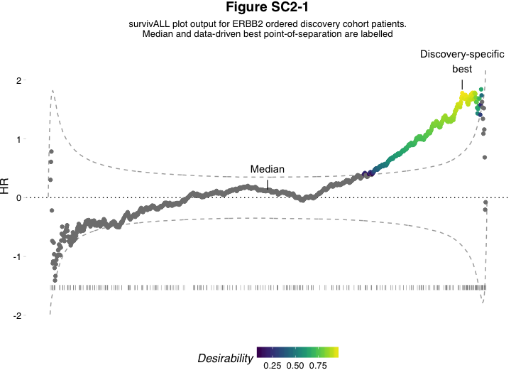
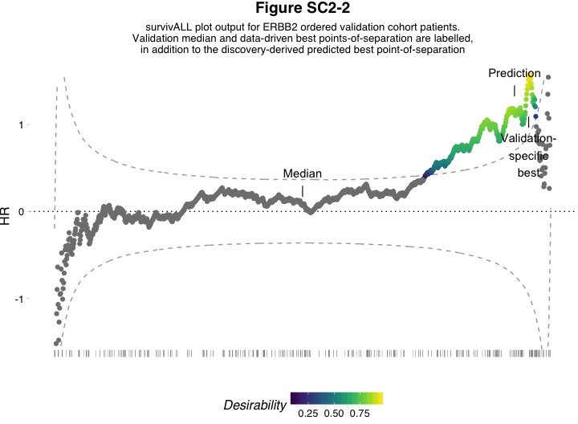

Continuous Biomarker Assessment by Exhaustive Survival Analysis - Supplementary Code 2
======================================================================================

#### 2018-04-26

Dominic A. Pearce<sup>1</sup>, Ajit J. Nirmal<sup>2</sup>, Tom Freeman<sup>2</sup>, Andrew H. Sims<sup>1</sup>

<sup>1</sup>Applied Bioinformatics of Cancer, University of Edinburgh Cancer Research Centre, Institute of Genetics and Molecular Medicine, Edinburgh, UK <sup>2</sup>Systems Immunology Group, Division of Genetics and Genomics, The Roslin Institute and Royal (Dick) School of Veterinary Studies, University of Edinburgh, Easter Bush, Midlothian, EH25 9RG
\*<andrew.sims@ed.ac.uk>

Genome-wide application
=======================

Having demonstrated the rationale motivating *survivALL* using the example of ERBB2, it remains important to show that it is extensible across the genome and, importantly, that it is informative for genes for which we possess no *a priori* assumptions.

Furthermore, when determining the optimal point-of-separation in one cohort, the associated level of expression should be applicable to a second set of patients, at least more so than an arbitrary median approach allows.

To investigate these considerations, we continued to utilise the previously published METABRIC dataset. As part of the original IntClust10 subtyping scheme publication, the METABRIC data was divided into *discovery* and *validation* subsets, which are compositionally matched and allow us to apply an optimum point-of-separation from the *discovery* cohort to the *validation*. Here we demonstrate these for ERBB2, before applying the process to the entire transcriptome.

### Libraries

``` r
library(survivALL)
library(readr)
library(Biobase)
library(magrittr)
library(ggplot2)
library(ggthemes)
library(knitr)
```

 

As with Supplementary 1, we must first curate our data to be sure that it contains only patients with complete survival information. In this instance our event of interest is disease specific survival (*dss*).

METABRIC gene expression data used for this analysis was downloaded, upon request, from [https://www.synapse.org/](https://www.synapse.org/#!Synapse:syn1688369/wiki/27311)

 

``` r
disc <- read_rds("discovery-eset.Rds")
val <- read_rds("validation-eset.Rds")
disc_bootstrap <- read.delim("disc-bs.txt") #for more information regarding 
val_bootstrap <- read.delim("val-bs.txt")   #bootstrapping see Supplementary Code 4
```

``` r
disc
#> ExpressionSet (storageMode: lockedEnvironment)
#> assayData: 19628 features, 980 samples 
#>   element names: exprs 
#> protocolData: none
#> phenoData
#>   sampleNames: MB-0362 MB-0346 ... MB-0133 (980 total)
#>   varLabels: age_at_diagnosis last_follow_up_status ... e.dss (31
#>     total)
#>   varMetadata: labelDescription
#> featureData: none
#> experimentData: use 'experimentData(object)'
#> Annotation:

val
#> ExpressionSet (storageMode: lockedEnvironment)
#> assayData: 19628 features, 991 samples 
#>   element names: exprs 
#> protocolData: none
#> phenoData
#>   sampleNames: MB-0005 MB-0048 ... MB-4823 (991 total)
#>   varLabels: age_at_diagnosis last_follow_up_status ... e.dss (31
#>     total)
#>   varMetadata: labelDescription
#> featureData: none
#> experimentData: use 'experimentData(object)'
#> Annotation:
```

 

We now have two ExpressionSets, detailing 980 (*discovery*) and 991 (*validation*) samples; 19628 features; and 31 phenotypic measures including *dss* and time-to-*dss* information. We first check that our gene of interest --- here *ERBB2* --- is significant in both datasets.

 

``` r
checkContSig(measure = exprs(disc)["ERBB2", ],
             time = disc$t.dss,
             event = disc$e.dss
             ) < 0.05
#> [1] TRUE

checkContSig(measure = exprs(val)["ERBB2", ],
             time = val$t.dss,
             event = val$e.dss
             ) < 0.05
#> [1] TRUE
```

 

Having satisfied this, we then calculate the dataset-specific best point-of-separation in our *discovery* set, using the `survivALL()` function.

 

``` r
#calculate all survival statistics
discall_erbb2 <- survivALL(measure = exprs(disc)["ERBB2", ], 
          srv = pData(disc),
          time = "t.dss", 
          event = "e.dss", 
          bs_dfr = disc_bootstrap,
          measure_name = "ERBB2")
discall_erbb2$dset <- "disc"

optimal_index_disc <- which(diff(discall_erbb2$clsf) == 1) 
#i.e. where our classifier changes from 0 to 1

#this index corresponds to a specific patient and therefore a specific level
#of expression
prediction_xpr <- discall_erbb2$measure[optimal_index_disc]
```

 

We can visualise this dataset-specific best, as well as the median, points-of-separation for comparison

 

``` r
p_disc <- plotALL(measure = exprs(disc)["ERBB2", ], 
          srv = pData(disc),
          time = "t.dss", 
          event = "e.dss", 
          bs_dfr = disc_bootstrap,
          measure_name = "ERBB2") 
          
median_index_val <- nrow(discall_erbb2) / 2
annotation_dfr <- data.frame(index = c(median_index_val, optimal_index_disc),
                             y = c(0.37, 2.2),
                             annot = c("Median\n|", "Discovery-specific\nbest\n|"))

p_disc + 
    geom_text(aes(x = index, y = y, label = annot), data = annotation_dfr) +
    labs(title = "Figure SC2-1",
         subtitle = "survivALL plot output for ERBB2 ordered discovery cohort patients.\nMedian and data-driven best point-of-separation are labelled") + 
    theme(plot.subtitle = element_text(hjust = 0.5)) +
    ylim(-2, 2.4)
```



 

Having determined out predicted stratifying level of expression we now determine the *validation* cohorts best point-of-separation...

 

``` r
#calculate all survival statistics, this time for val
valall_erbb2 <- survivALL(measure = exprs(val)["ERBB2", ], 
                          srv = pData(val),
                          time = "t.dss", 
                          event = "e.dss", 
                          bs_dfr = val_bootstrap,
                          measure_name = "ERBB2"
                          )
valall_erbb2$dset <- "val"

optimal_index_val <- which(diff(valall_erbb2$clsf) == 1) 
#again, where our classifier changes from 0 to 1 is the optimal separation 
#index

#which corresponds to a defined level of expression
prediction_index <- which(valall_erbb2$measure >= prediction_xpr)[1]
```

 

and compare how accurately the *survivALL* prediction reflects the optimal, compared to using median expression as a predictor.

 

``` r
p_val <- plotALL(measure = exprs(val)["ERBB2", ], 
                 srv = pData(val),
                 time = "t.dss", 
                 event = "e.dss", 
                 bs_dfr = val_bootstrap,
                 measure_name = "ERBB2"
                 ) 

median_index_val <- nrow(valall_erbb2) / 2

annotation_dfr <- data.frame(index = c(median_index_val, optimal_index_val, prediction_index),
                             y = c(0.35, 0.75, 1.5),
                             annot = c("Median\n|", "|\nValidation-\nspecific\nbest", "Prediction\n|"))

p_val + 
    geom_text(aes(x = index, y = y, label = annot), data = annotation_dfr) +
    labs(title = "Figure SC2-2",
         subtitle = "survivALL plot output for ERBB2 ordered validation cohort patients.\nValidation median and data-driven best points-of-separation are labelled,\nin addition to the discovery-derived predicted best point-of-separation") + 
         theme(plot.subtitle = element_text(hjust = 0.5))
```



 

Here the predicted point-of-separation closely replicates the true *validation* optimal. To quantify this value, we measure the distance between the predicted and optimal point-of-separation as well as between the median and optimal point-of-separation to demonstrate relative benefit of one method compared to the other. This is returned as the percentage of patients who would be incorrecly classified by each method (median vs. *survivALL* approaches).

 

``` r
prediction_offset <- c(abs(optimal_index_val - prediction_index),
                    abs(optimal_index_val - median_index_val))

comparison_dfr <- data.frame(gene = "ERBB2", 
                             prediction_offset = prediction_offset,
                             approach = c("survivALL", "Median"))

kable(comparison_dfr)
```

| gene  |  prediction\_offset| approach  |
|:------|-------------------:|:----------|
| ERBB2 |                28.0| survivALL |
| ERBB2 |               450.5| Median    |

 

By repeating this procedure across the entire transcriptome (as in the main paper's Figure 1C) we can demonstrate the consistent global applicability of *survivALL* over an arbitrary median stratification approach.

 

Session Information
===================

``` r
sessioninfo::session_info()
#> ─ Session info ──────────────────────────────────────────────────────────
#>  setting  value                       
#>  version  R version 3.4.1 (2017-06-30)
#>  os       macOS Sierra 10.12.2        
#>  system   x86_64, darwin15.6.0        
#>  ui       X11                         
#>  language (EN)                        
#>  collate  en_GB.UTF-8                 
#>  tz       Europe/London               
#>  date     2018-04-26                  
#> 
#> ─ Packages ──────────────────────────────────────────────────────────────
#>  package       * version    date      
#>  assertthat      0.2.0      2017-04-11
#>  audio           0.1-5      2013-12-23
#>  backports       1.1.2      2017-12-13
#>  beepr         * 1.2        2015-06-14
#>  bindr           0.1        2016-11-13
#>  bindrcpp        0.2        2017-06-17
#>  Biobase       * 2.36.2     2017-05-04
#>  BiocGenerics  * 0.22.1     2017-10-06
#>  BiocInstaller * 1.26.1     2017-09-01
#>  bootstrap       2017.2     2017-02-27
#>  broom           0.4.3      2017-11-20
#>  clisymbols      1.2.0      2017-05-21
#>  colorspace      1.3-2      2016-12-14
#>  desiR           1.2.1      2016-12-10
#>  digest          0.6.15     2018-01-28
#>  dplyr           0.7.4      2017-09-28
#>  evaluate        0.10.1     2017-06-24
#>  foreign         0.8-69     2017-06-21
#>  ggplot2       * 2.2.1      2016-12-30
#>  ggthemes      * 3.4.2      2018-04-03
#>  glue            1.2.0      2017-10-29
#>  gridExtra       2.3        2017-09-09
#>  gtable          0.2.0      2016-02-26
#>  highr           0.6        2016-05-09
#>  hms             0.4.1      2018-01-24
#>  htmltools       0.3.6      2017-04-28
#>  KernSmooth      2.23-15    2015-06-29
#>  knitr         * 1.19       2018-01-29
#>  labeling        0.3        2014-08-23
#>  lattice         0.20-35    2017-03-25
#>  lava            1.6        2018-01-13
#>  lazyeval        0.2.1      2017-10-29
#>  magrittr      * 1.5        2014-11-22
#>  Matrix          1.2-12     2017-11-15
#>  mnormt          1.5-5      2016-10-15
#>  munsell         0.4.3      2016-02-13
#>  nlme            3.1-131    2017-02-06
#>  pander          0.6.1      2017-08-06
#>  pillar          1.1.0      2018-01-14
#>  pkgconfig       2.0.1      2017-03-21
#>  plyr            1.8.4      2016-06-08
#>  prodlim         1.6.1      2017-03-06
#>  psych           1.7.8      2017-09-09
#>  purrr           0.2.4      2017-10-18
#>  R6              2.2.2      2017-06-17
#>  Rcpp            0.12.15    2018-01-20
#>  readr         * 1.1.1      2017-05-16
#>  reshape2        1.4.3      2017-12-11
#>  rlang           0.1.6      2017-12-21
#>  rmarkdown       1.8        2017-11-17
#>  rmeta           2.16       2012-10-29
#>  rprojroot       1.3-2      2018-01-03
#>  scales          0.5.0      2017-08-24
#>  sessioninfo     1.0.0      2017-06-21
#>  stringi         1.1.6      2017-11-17
#>  stringr         1.3.0      2018-02-19
#>  SuppDists       1.1-9.4    2016-09-23
#>  survcomp        1.26.0     2017-04-25
#>  survival      * 2.41-3     2017-04-04
#>  survivALL     * 0.9.2.1000 2018-04-24
#>  survivalROC     1.0.3      2013-01-13
#>  tibble          1.4.2      2018-01-22
#>  tidyr           0.8.0      2018-01-29
#>  viridis         0.5.1      2018-03-29
#>  viridisLite     0.3.0      2018-02-01
#>  withr           2.1.2      2018-03-15
#>  yaml            2.1.16     2017-12-12
#>  source                              
#>  CRAN (R 3.4.1)                      
#>  CRAN (R 3.4.0)                      
#>  CRAN (R 3.4.1)                      
#>  CRAN (R 3.4.1)                      
#>  CRAN (R 3.4.1)                      
#>  CRAN (R 3.4.1)                      
#>  Bioconductor                        
#>  Bioconductor                        
#>  Bioconductor                        
#>  cran (@2017.2)                      
#>  CRAN (R 3.4.1)                      
#>  CRAN (R 3.4.1)                      
#>  CRAN (R 3.4.1)                      
#>  CRAN (R 3.4.1)                      
#>  CRAN (R 3.4.1)                      
#>  CRAN (R 3.4.1)                      
#>  CRAN (R 3.4.1)                      
#>  CRAN (R 3.4.1)                      
#>  CRAN (R 3.4.1)                      
#>  cran (@3.4.2)                       
#>  CRAN (R 3.4.1)                      
#>  CRAN (R 3.4.1)                      
#>  CRAN (R 3.4.1)                      
#>  CRAN (R 3.4.1)                      
#>  CRAN (R 3.4.1)                      
#>  CRAN (R 3.4.1)                      
#>  CRAN (R 3.4.1)                      
#>  CRAN (R 3.4.1)                      
#>  CRAN (R 3.4.1)                      
#>  CRAN (R 3.4.1)                      
#>  CRAN (R 3.4.1)                      
#>  CRAN (R 3.4.1)                      
#>  CRAN (R 3.4.0)                      
#>  CRAN (R 3.4.2)                      
#>  CRAN (R 3.4.0)                      
#>  CRAN (R 3.4.1)                      
#>  CRAN (R 3.4.1)                      
#>  CRAN (R 3.4.1)                      
#>  CRAN (R 3.4.1)                      
#>  CRAN (R 3.4.1)                      
#>  CRAN (R 3.4.1)                      
#>  CRAN (R 3.4.1)                      
#>  CRAN (R 3.4.1)                      
#>  CRAN (R 3.4.1)                      
#>  CRAN (R 3.4.1)                      
#>  CRAN (R 3.4.1)                      
#>  CRAN (R 3.4.1)                      
#>  CRAN (R 3.4.1)                      
#>  CRAN (R 3.4.1)                      
#>  CRAN (R 3.4.1)                      
#>  CRAN (R 3.4.1)                      
#>  CRAN (R 3.4.1)                      
#>  CRAN (R 3.4.1)                      
#>  CRAN (R 3.4.1)                      
#>  CRAN (R 3.4.2)                      
#>  CRAN (R 3.4.3)                      
#>  CRAN (R 3.4.1)                      
#>  Bioconductor                        
#>  CRAN (R 3.4.1)                      
#>  Github (pearcedom/survivALL@53029f1)
#>  CRAN (R 3.4.1)                      
#>  CRAN (R 3.4.1)                      
#>  CRAN (R 3.4.1)                      
#>  cran (@0.5.1)                       
#>  CRAN (R 3.4.1)                      
#>  CRAN (R 3.4.4)                      
#>  CRAN (R 3.4.1)
```
