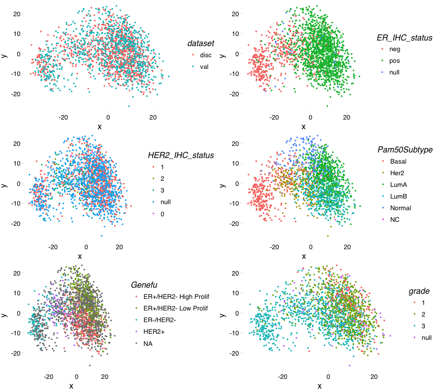
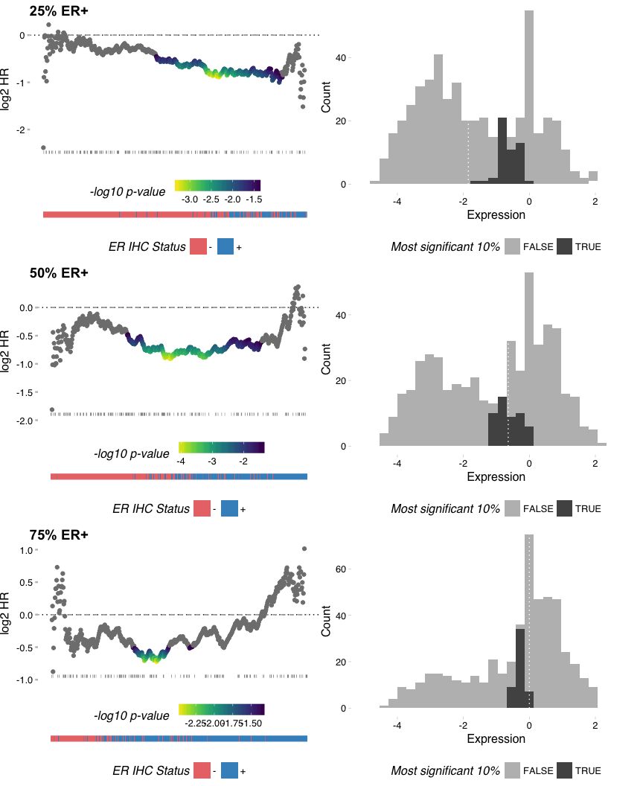

Continuous Biomarker Assessment by Exhaustive Survival Analysis - Supplementary Code 3
======================================================================================

#### 2018-04-26

Dominic A. Pearce<sup>1</sup>, Ajit J. Nirmal<sup>2</sup>, Tom Freeman<sup>2</sup>, Andrew H. Sims<sup>1</sup>

<sup>1</sup>Applied Bioinformatics of Cancer, University of Edinburgh Cancer Research Centre, Institute of Genetics and Molecular Medicine, Edinburgh, UK <sup>2</sup>Systems Immunology Group, Division of Genetics and Genomics, The Roslin Institute and Royal (Dick) School of Veterinary Studies, University of Edinburgh, Easter Bush, Midlothian, EH25 9RG
\*<andrew.sims@ed.ac.uk>

Compositionally unmatched data and consistency
----------------------------------------------

Having demonstrated the consistent, genome-wide applicability of *survivALL* (*see:* supplementary 2), it remained to be seen whether *survivALL* could reproducibly determine a best point-of-separation that was consistent between datasets with differing compositions.

To achieve this, we semi-randomly sampled from the combined discovery and validation METABRIC datasets. The *semi*-random aspect here was that though we would randomly select samples, we would pre-define the proportion of a clinical variable - here estrogen receptor (ER) positivity, as measure by immunohistochemistry (IHC). In this way, we can produce data subsets with random compositions of all factors except for ER status. We are then able to test, upon changing the proportion of ER+ vs. ER- samples, whether *survivALL* is able to correctly dichotomise ER+ samples from ER-, using *GATA3* gene expression (a known marker of ER positivity).

The final step of this experiment will be to check that, for each differing ER+/ER- proportion, the derived level of *GATA3* expression that best stratifies the subsets remains consistent. *GATA3*'s selection allows us to hypothetical investigate a novel biomarker under conditions of dataset inconsistency and to therefore demonstrate the false-negative danger in using arbitrary dichotomisation approaches.

### Libraries

``` r
library(survivALL)
library(readr)
library(magrittr)
library(Biobase)
library(a4Base)
library(ggthemes)
library(cowplot); theme_set(theme_grey())
source("lib/mostVar.R")
source("lib/mdsArrange.R")
```

 

The first step, however, is to combine our discovery and validation expression sets, checking that there are no inherent batch effects that need to be accounted for. We achieve this by plotting an MDS representation of the 500 most variable genes, and determining whether or not samples cluster by their original dataset, as well as that the expected biological clustering (e.g. by subtype) is unaffected.

 

``` r
disc <- read_rds("discovery-eset.Rds")
val <- read_rds("validation-eset.Rds")
disc$dataset <- "disc"
val$dataset <- "val"
metabric <- combineTwoExpressionSet(disc, val)

mb500 <- mostVar(exprs(metabric), 500)
mds_dfr <- mdsArrange(mb500, isAlreadyScaled = TRUE)
mrg_dfr <- merge(mds_dfr, pData(metabric), by.x = 'ids', by.y = 0)

factors_to_colour <- c("dataset", "ER_IHC_status", "HER2_IHC_status", "Pam50Subtype", "Genefu", "grade")

mds_lst <- lapply(factors_to_colour, function(factor){
                      ggplot(mrg_dfr, aes_string(x = "x", y = "y", colour = factor)) + 
                          geom_point(size = 0.4) +
                          theme_pander() 
                      })
```

#### Figure SC3-1

MDS using the 500 most variable genes, coloured by varying phenotypic factors. There is little evidence to suggest that the discovery and validation METABRIC subsets cannot be directly integrated without correction.

``` r
plot_grid(plotlist = mds_lst, ncol = 2)
```



 

Satisfied that to simply combine the two datasets is acceptable, we now compose two functions to: \* Select our semi-randomly sampled patients \* Plot \* survivALL's plotALL() figures for each varying proportion \* histograms highlighting the 10% most significant values of expression associated with GATA3 dichotomisation

 

``` r
compSelect <- function(proportion) {
    pheno <- pData(metabric)
    col <- "ER_IHC_status"
    vars <- c("pos", "neg")
    subset_samples <- sapply(1:length(vars), function(x) {
                                 samples <- row.names(pheno)[which(pheno[[col]] == vars[x])]
                                 sample(samples, proportion[x])
                        }) %>% unlist() 
    metabric[, colnames(metabric) %in% subset_samples]
}

plotSubsets <- function(sub_metabric, gene = "GATA3"){
    # plot HR distribution
    measure <- exprs(sub_metabric)[gene,]
    p_all <- plotALL(measure, pData(sub_metabric), "t.dss", "e.dss") + 
        labs(colour = "-log10 p-value", 
             y = "log2 HR") + 
        theme(plot.title = element_text(hjust = 0),
              axis.ticks = element_line(size = 0.85),
              legend.position = 'bottom')  

    # plot ER IHC status
    srvall_dfr <- survivALL(measure, pData(sub_metabric), "t.dss", "e.dss")
    mrg_dfr <- merge(srvall_dfr, pData(sub_metabric), by.x = 'samples', by.y = 0)
    p_prop <- ggplot(mrg_dfr, aes(x = index, y = "ER Status", fill = ER_IHC_status)) +
        geom_tile() + 
        labs(fill = "ER IHC Status", y = " ") + 
        scale_fill_manual(values = c("#ea7676", "#4292c6"), labels = c("-", "+")) + 
        theme_pander() + 
        theme(axis.text.x = element_blank(), 
              axis.ticks.x = element_blank(),
              axis.title.x = element_blank(),
              axis.text.y = element_blank(), 
              axis.ticks.y = element_blank(),
              legend.position = 'bottom')

    # plot gene expression histogram
    mrg_dfr$most_sig <- ifelse(mrg_dfr$p < quantile(mrg_dfr$p, 0.1, na.rm = TRUE), 
                                  TRUE, FALSE)
    p_hist <- ggplot(mrg_dfr, aes(x = measure, fill = most_sig)) + 
        geom_histogram() +
        geom_vline(xintercept = median(srvall_dfr$measure), linetype = 3, colour = "WHITE") + 
        xlim(-5, 3) +
        scale_fill_manual(values = c("#bdbdbd", "#525252"), breaks = c(FALSE, TRUE)) + 
        labs(y = "Count", x = "Expression", fill = "Most significant 10%") + 
        theme_pander() + 
        theme(legend.position = 'bottom') 

    # combine plots
    p1 <- plot_grid(p_all, p_prop, ncol = 1, align = 'v', rel_heights = c(4, 1))
    plot_grid(p1, p_hist, nrow = 1, align = 'h')
}
```

 

Using a subset size of `n = 500` and pre-defined proportions of ER positivity (25%, 50%, 75%) we then produce our METABRIC subsets and plot, reproducing Figure 2 from the manuscript.

 

``` r
n = 500 # subset size
proportion_lst <- list(p25 = c(130, 370), # proportions of ER +/- samples
                        p50 = c(250, 250),
                        p75 = c(370, 130))

set.seed(314); metabric_subsets <- lapply(proportion_lst, compSelect) 
subset_plots <- lapply(metabric_subsets, plotSubsets) 
```

#### Figure SC3-2

As the proportion of ER+ samples changes, so does the subset-specific best point-of-separation. Therefore, an arbitrary approach, such as median dichotomisation (right panels, dashed white line) will fail to consistently capture this division. If however this divison is determined reproducibly, as *survivALL* is able to achieve, a consistent level of expression (right panels, most significant associations in dark grey) associated with this division can be determined.

``` r
plot_grid(plotlist = subset_plots, ncol = 1, labels = c("25% ER+", "50% ER+", "75% ER+"))
```



 

 

Session Information
===================

``` r
sessioninfo::session_info()
#> ─ Session info ──────────────────────────────────────────────────────────
#>  setting  value                       
#>  version  R version 3.4.1 (2017-06-30)
#>  os       macOS Sierra 10.12.2        
#>  system   x86_64, darwin15.6.0        
#>  ui       X11                         
#>  language (EN)                        
#>  collate  en_GB.UTF-8                 
#>  tz       Europe/London               
#>  date     2018-04-26                  
#> 
#> ─ Packages ──────────────────────────────────────────────────────────────
#>  package       * version    date      
#>  a4Base        * 1.24.0     2017-04-25
#>  a4Core        * 1.24.0     2017-04-25
#>  a4Preproc     * 1.24.0     2017-04-25
#>  annaffy       * 1.48.0     2017-04-25
#>  annotate        1.54.0     2017-04-25
#>  AnnotationDbi * 1.38.2     2017-07-27
#>  assertthat      0.2.0      2017-04-11
#>  audio           0.1-5      2013-12-23
#>  backports       1.1.2      2017-12-13
#>  beepr         * 1.2        2015-06-14
#>  Biobase       * 2.36.2     2017-05-04
#>  BiocGenerics  * 0.22.1     2017-10-06
#>  BiocInstaller * 1.26.1     2017-09-01
#>  bit             1.1-12     2014-04-09
#>  bit64           0.9-7      2017-05-08
#>  bitops          1.0-6      2013-08-17
#>  blob            1.1.0      2017-06-17
#>  bootstrap       2017.2     2017-02-27
#>  caTools         1.17.1     2014-09-10
#>  clisymbols      1.2.0      2017-05-21
#>  codetools       0.2-15     2016-10-05
#>  colorspace      1.3-2      2016-12-14
#>  cowplot       * 0.9.2      2017-12-17
#>  DBI             0.7        2017-06-18
#>  digest          0.6.15     2018-01-28
#>  evaluate        0.10.1     2017-06-24
#>  foreach       * 1.4.4      2017-12-12
#>  gdata           2.18.0     2017-06-06
#>  genefilter    * 1.58.1     2017-05-06
#>  ggplot2       * 2.2.1      2016-12-30
#>  ggthemes      * 3.4.2      2018-04-03
#>  glmnet        * 2.0-13     2017-09-22
#>  GO.db         * 3.4.1      2017-08-18
#>  gplots        * 3.0.1      2016-03-30
#>  gridExtra       2.3        2017-09-09
#>  gtable          0.2.0      2016-02-26
#>  gtools          3.5.0      2015-05-29
#>  hms             0.4.1      2018-01-24
#>  htmltools       0.3.6      2017-04-28
#>  IRanges       * 2.10.5     2017-10-08
#>  iterators       1.0.9      2017-12-12
#>  KEGG.db       * 3.2.3      2017-08-18
#>  KernSmooth    * 2.23-15    2015-06-29
#>  knitr           1.19       2018-01-29
#>  labeling        0.3        2014-08-23
#>  lattice         0.20-35    2017-03-25
#>  lava            1.6        2018-01-13
#>  lazyeval        0.2.1      2017-10-29
#>  limma         * 3.32.10    2017-10-13
#>  magrittr      * 1.5        2014-11-22
#>  MASS          * 7.3-48     2017-12-25
#>  Matrix        * 1.2-12     2017-11-15
#>  memoise         1.1.0      2017-04-21
#>  mpm           * 1.0-22     2011-11-25
#>  multtest      * 2.32.0     2017-04-25
#>  munsell         0.4.3      2016-02-13
#>  pander          0.6.1      2017-08-06
#>  pillar          1.1.0      2018-01-14
#>  pkgconfig       2.0.1      2017-03-21
#>  plyr            1.8.4      2016-06-08
#>  prodlim         1.6.1      2017-03-06
#>  R6              2.2.2      2017-06-17
#>  Rcpp            0.12.15    2018-01-20
#>  RCurl           1.95-4.10  2018-01-04
#>  readr         * 1.1.1      2017-05-16
#>  rlang           0.1.6      2017-12-21
#>  rmarkdown       1.8        2017-11-17
#>  rmeta           2.16       2012-10-29
#>  rprojroot       1.3-2      2018-01-03
#>  RSQLite         2.0        2017-06-19
#>  S4Vectors     * 0.14.7     2017-10-08
#>  scales          0.5.0      2017-08-24
#>  sessioninfo     1.0.0      2017-06-21
#>  stringi         1.1.6      2017-11-17
#>  stringr         1.3.0      2018-02-19
#>  SuppDists       1.1-9.4    2016-09-23
#>  survcomp        1.26.0     2017-04-25
#>  survival      * 2.41-3     2017-04-04
#>  survivALL     * 0.9.2.1000 2018-04-24
#>  survivalROC     1.0.3      2013-01-13
#>  tibble          1.4.2      2018-01-22
#>  viridis         0.5.1      2018-03-29
#>  viridisLite     0.3.0      2018-02-01
#>  withr           2.1.2      2018-03-15
#>  XML             3.98-1.9   2017-06-19
#>  xtable          1.8-2      2016-02-05
#>  yaml            2.1.16     2017-12-12
#>  source                              
#>  Bioconductor                        
#>  Bioconductor                        
#>  Bioconductor                        
#>  Bioconductor                        
#>  Bioconductor                        
#>  Bioconductor                        
#>  CRAN (R 3.4.1)                      
#>  CRAN (R 3.4.0)                      
#>  CRAN (R 3.4.1)                      
#>  CRAN (R 3.4.1)                      
#>  Bioconductor                        
#>  Bioconductor                        
#>  Bioconductor                        
#>  CRAN (R 3.4.1)                      
#>  CRAN (R 3.4.1)                      
#>  CRAN (R 3.4.1)                      
#>  CRAN (R 3.4.1)                      
#>  cran (@2017.2)                      
#>  CRAN (R 3.4.1)                      
#>  CRAN (R 3.4.1)                      
#>  CRAN (R 3.4.1)                      
#>  CRAN (R 3.4.1)                      
#>  CRAN (R 3.4.1)                      
#>  CRAN (R 3.4.1)                      
#>  CRAN (R 3.4.1)                      
#>  CRAN (R 3.4.1)                      
#>  CRAN (R 3.4.1)                      
#>  CRAN (R 3.4.1)                      
#>  Bioconductor                        
#>  CRAN (R 3.4.1)                      
#>  cran (@3.4.2)                       
#>  CRAN (R 3.4.2)                      
#>  Bioconductor                        
#>  CRAN (R 3.4.1)                      
#>  CRAN (R 3.4.1)                      
#>  CRAN (R 3.4.1)                      
#>  CRAN (R 3.4.1)                      
#>  CRAN (R 3.4.1)                      
#>  CRAN (R 3.4.1)                      
#>  Bioconductor                        
#>  CRAN (R 3.4.1)                      
#>  Bioconductor                        
#>  CRAN (R 3.4.1)                      
#>  CRAN (R 3.4.1)                      
#>  CRAN (R 3.4.1)                      
#>  CRAN (R 3.4.1)                      
#>  CRAN (R 3.4.1)                      
#>  CRAN (R 3.4.1)                      
#>  Bioconductor                        
#>  CRAN (R 3.4.0)                      
#>  CRAN (R 3.4.1)                      
#>  CRAN (R 3.4.2)                      
#>  CRAN (R 3.4.1)                      
#>  CRAN (R 3.4.1)                      
#>  Bioconductor                        
#>  CRAN (R 3.4.1)                      
#>  CRAN (R 3.4.1)                      
#>  CRAN (R 3.4.1)                      
#>  CRAN (R 3.4.1)                      
#>  CRAN (R 3.4.1)                      
#>  CRAN (R 3.4.1)                      
#>  CRAN (R 3.4.1)                      
#>  CRAN (R 3.4.1)                      
#>  CRAN (R 3.4.1)                      
#>  CRAN (R 3.4.1)                      
#>  CRAN (R 3.4.1)                      
#>  CRAN (R 3.4.1)                      
#>  CRAN (R 3.4.1)                      
#>  CRAN (R 3.4.1)                      
#>  CRAN (R 3.4.1)                      
#>  Bioconductor                        
#>  CRAN (R 3.4.1)                      
#>  CRAN (R 3.4.1)                      
#>  CRAN (R 3.4.2)                      
#>  CRAN (R 3.4.3)                      
#>  CRAN (R 3.4.1)                      
#>  Bioconductor                        
#>  CRAN (R 3.4.1)                      
#>  Github (pearcedom/survivALL@53029f1)
#>  CRAN (R 3.4.1)                      
#>  CRAN (R 3.4.1)                      
#>  cran (@0.5.1)                       
#>  CRAN (R 3.4.1)                      
#>  CRAN (R 3.4.4)                      
#>  CRAN (R 3.4.1)                      
#>  CRAN (R 3.4.1)                      
#>  CRAN (R 3.4.1)
```
