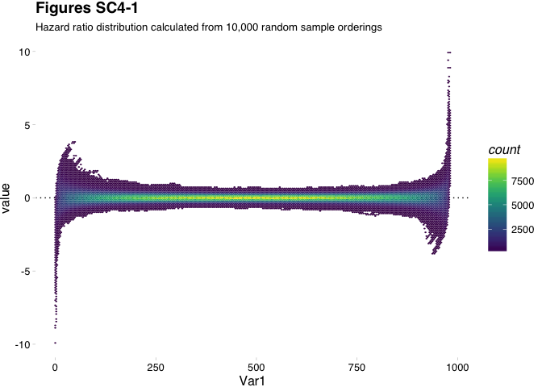

 

Bootstrapping and hazard ratio thresholds
-----------------------------------------

 

### Libraries

``` r
library(survivALL)
library(Biobase)
library(reshape2)
library(ggplot2)
library(ggthemes)
library(knitr)
```

 

When performing a large number of statistical test, as is integral to the `survivALL` rationale, it is important to protect against false positive results using some form of multiple testing correction. For `survivALL` this is implemented as a bootstrapping exercise to determine robust thresholds of hazard ratio significance. In short we calculate, for each point-of-separation a upper and lower limit within which we expect to see hazard ratios occur by chance, and beyond which hazard ratios are unlikely (1 in 20) to have occurred by chance.

To achieve this, we randomly sample our survival data with replacement and calculate survival statistics for all points-of-separation, as we would using for a biomarker under investigation. By repeating this procedure 1,000s or 10,000s of times, we produce a distribution of *expected* hazard ratios, of which we use the mean and standard deviation to calculate our per-point-of-separation significance.

 

``` r
disc <- readRDS("discovery-eset.Rds") #see Supplementary 1 for more info on disc

#bootstrapping data should be created in the format of 1 repetition per column
bs_mtx <- matrix(nrow = ncol(disc), ncol = 10000)

system.time(
            for(i in 1:ncol(bs_mtx)){
                bs_mtx[, i] <- allHR(measure = sample(1:ncol(disc), 
                                                      replace = TRUE),
                                     srv = pData(disc),
                                     time = "t.dmfs",
                                     event = "e.dmfs")
            }
)
```

``` r
kable(bs_mtx[1:20, 1:5])
```

|          V1|          V2|         V3|          V4|          V5|
|-----------:|-----------:|----------:|-----------:|-----------:|
|  -4.2985760|          NA|         NA|          NA|          NA|
|  -1.2497716|  -0.5006925|         NA|          NA|  -1.0721970|
|  -1.5452649|   0.2061469|         NA|          NA|  -1.7503348|
|  -2.0365849|   0.4693223|         NA|          NA|  -1.1198149|
|  -1.5134552|   0.4693223|         NA|          NA|  -0.4904476|
|  -1.0492810|   0.5561135|         NA|   0.8959700|  -0.8227830|
|  -0.7008058|  -0.2029949|         NA|  -0.0048401|  -1.1709956|
|  -0.6418548|   0.0974521|         NA|   0.2846912|  -0.9207821|
|  -0.5619627|   0.3314171|         NA|   0.5103646|  -1.1635300|
|  -0.4622613|   0.5601122|  1.7477283|   0.7147431|  -1.0587921|
|  -0.3395972|   0.0230835|  1.9244026|   0.8508627|  -0.8125205|
|  -0.0282329|   0.1291360|  1.0490482|   1.0287279|  -0.9450526|
|  -0.4110332|   0.3221217|  1.1820121|   1.0954043|  -0.7827766|
|  -0.2180065|   0.4929464|  1.2882057|   0.5551933|  -0.7527642|
|  -0.2180065|   0.1171855|  1.4229195|   0.1901938|  -0.9003891|
|  -0.0875949|   0.1292967|  0.8540924|   0.2286172|  -0.8406196|
|   0.0861964|  -0.1945422|  0.4484826|   0.2751000|  -0.9819058|
|   0.1836266|  -0.3395630|  0.5947533|   0.0135470|  -0.9242119|
|   0.3567013|  -0.2270098|  0.7047795|   0.1290378|  -0.9829026|
|   0.0474136|  -0.1397093|  0.7955054|  -0.1085851|  -0.9119966|

 

In essence, this procedure creates our distribution of expected hazard ratios that can themselves be visualised.

 

``` r
bs_dfr <- melt(bs_mtx)

ggplot(bs_dfr, aes(x = Var1, y = value)) + 
        geom_hline(yintercept = 0, linetype = 3) +
        #geom_point(alpha = 0.0065) + 
        geom_hex(bins = 200) + 
        theme_pander()
```



 

Having calculated our bootstrapped data we then simply hand the matrix to either the `survivALL()` or `plotALL()` functions to handle the subsequent thresholding and p-value calculations. It should be noted that thresholding up to 10,000x can be a long process requiring an investment of time.

Session Information
-------------------

``` r
sessioninfo::session_info()
```

─ Session info ────────────────────────────────────────────────────────── setting value
version R version 3.4.1 (2017-06-30) os macOS Sierra 10.12.2
system x86\_64, darwin15.6.0
ui X11
language (EN)
collate en\_US.UTF-8
tz Europe/London
date 2018-02-15

─ Packages ────────────────────────────────────────────────────────────── package \* version date source
assertthat 0.2.0 2017-04-11 CRAN (R 3.4.0)
audio 0.1-5 2013-12-23 CRAN (R 3.4.0)
backports 1.1.2 2017-12-13 CRAN (R 3.4.3)
beepr \* 1.2 2015-06-14 CRAN (R 3.4.0)
Biobase \* 2.36.2 2017-05-04 Bioconductor
BiocGenerics \* 0.22.1 2017-10-06 Bioconductor
BiocInstaller \* 1.26.1 2017-09-01 Bioconductor
clisymbols 1.2.0 2017-05-21 CRAN (R 3.4.0)
colorout \* 1.1-2 2017-08-04 Github (<jalvesaq/colorout@020a14d>) colorspace 1.3-2 2016-12-14 CRAN (R 3.4.0)
digest 0.6.14 2018-01-14 CRAN (R 3.4.3)
evaluate 0.10.1 2017-06-24 CRAN (R 3.4.1)
ggplot2 \* 2.2.1 2016-12-30 CRAN (R 3.4.0)
ggthemes \* 3.4.0 2017-02-19 cran (@3.4.0)
gtable 0.2.0 2016-02-26 CRAN (R 3.4.0)
hexbin \* 1.27.2 2018-01-15 CRAN (R 3.4.3)
highr 0.6 2016-05-09 CRAN (R 3.4.0)
htmltools 0.3.6 2017-04-28 CRAN (R 3.4.0)
knitr \* 1.18 2017-12-27 CRAN (R 3.4.3)
labeling 0.3 2014-08-23 CRAN (R 3.4.0)
lattice 0.20-35 2017-03-25 CRAN (R 3.4.1)
lazyeval 0.2.1 2017-10-29 CRAN (R 3.4.2)
magrittr 1.5 2014-11-22 CRAN (R 3.4.0)
munsell 0.4.3 2016-02-13 CRAN (R 3.4.0)
pander 0.6.1 2017-08-06 cran (@0.6.1)
pillar 1.1.0 2018-01-14 CRAN (R 3.4.3)
plyr 1.8.4 2016-06-08 CRAN (R 3.4.0)
Rcpp 0.12.14 2017-11-23 cran (@0.12.14)
reshape2 \* 1.4.3 2017-12-11 cran (@1.4.3)
rlang 0.1.6 2017-12-21 CRAN (R 3.4.3)
rmarkdown 1.8 2017-11-17 CRAN (R 3.4.2)
rprojroot 1.3-2 2018-01-03 CRAN (R 3.4.3)
scales 0.5.0 2017-08-24 CRAN (R 3.4.1)
sessioninfo 1.0.0 2017-06-21 CRAN (R 3.4.1)
stringi 1.1.6 2017-11-17 CRAN (R 3.4.2)
stringr 1.2.0 2017-02-18 CRAN (R 3.4.0)
survivALL \* 0.9.1.9000 2018-02-15 local (<pearcedom/survivALL@NA>)
tibble 1.4.1 2017-12-25 CRAN (R 3.4.1)
withr 2.1.1 2017-12-19 CRAN (R 3.4.3)
yaml 2.1.16 2017-12-12 CRAN (R 3.4.3)
